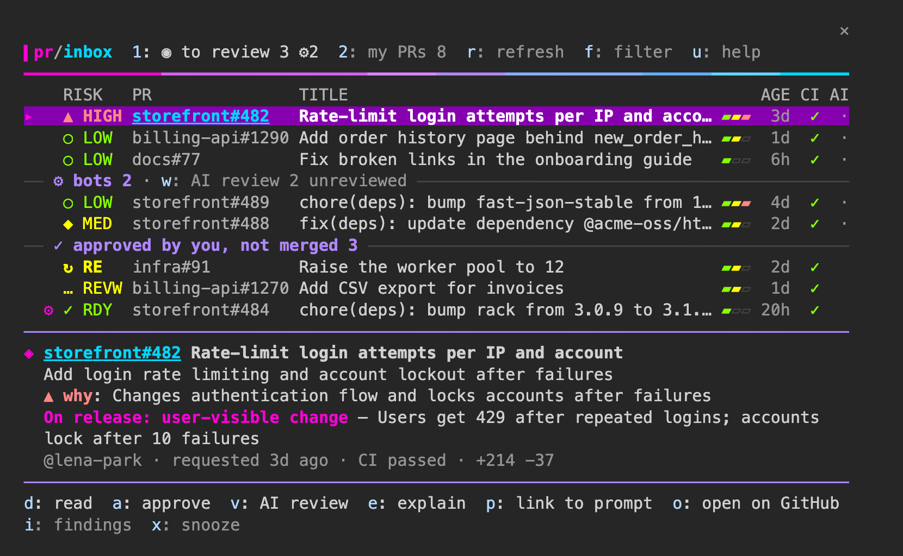

# pr-inbox

A Claude Code mod that turns your review requests and your own pull requests into an inbox, ordered by what needs you next.

- A status line under the prompt keeps the counts in view (`👀 To review 3 (+2 bot) · ⚠ High risk 1 · 🔴 Needs action 1 · ✅ Ready 1 · ⏳ Waiting 2`)
- `/pr-inbox` opens a pane in the spirit of lazygit and gh-dash: one line per PR (risk or state, how long it has waited as a heat bar, CI, AI review), the selected PR's details under the list, and the keys on the bottom line. Two tabs
  - **To review**: review requests, the longest-waiting first. Each PR gets an AI summary, a risk level (low / medium / high) and its impact on release (visible to users / not visible / cannot tell), taking feature flags into account
  - **My PRs**: needs action (changes requested, CI failed, conflict) → ready to merge → waiting for review → stale. Failed CI checks are listed with links to their runs
- A toast tells you about new review requests, and when your PRs are approved, get changes requested or fail CI. New review requests also raise an OS notification (macOS and Linux), so you see them outside Claude Code too



Tested with Claude Code v2.1.288. Mods need v2.1.287 or later.

## Install

In Claude Code:

```
/plugin marketplace add 2bo/pr-inbox
/plugin install pr-inbox@pr-inbox
```

Or from the shell: `claude plugin marketplace add 2bo/pr-inbox && claude plugin install pr-inbox@pr-inbox`.

## Usage

| Key | Action |
| :- | :- |
| `1` / `2` | To review / My PRs |
| `j` / `k` | Select the next / previous PR |
| `e` | Ask Claude to explain the PR (for your own PR, to diagnose what blocks it). Claude reads the description, comments, reviews and linked issues and PRs, not only the diff |
| `a` | Approve (runs only after you choose **Approve** in the confirmation dialog, where **Cancel** is selected first) |
| `v` | AI review, then approve if it passes (see below). `v` again cancels a running review |
| `d` | Details: every finding of the AI review, with links to the lines |
| `x` | Snooze the PR until it is updated (`z` shows snoozed PRs) |
| `w` | AI review every bot PR not reviewed yet, one at a time (`w` again stops) |
| `m` | Merge one of your PRs that is ready, after picking a method (pinned to the commit on screen) |
| `c` | Re-run the failed GitHub Actions jobs of one of your PRs |
| `f` | Filter by repository, number, title or @author (Enter keeps it; an empty one clears it) |
| `h` | Show the keys |
| `Ctrl+X` `Tab` | Move between the prompt and the pane. Keys reach the pane only while it has the focus |
| `o` | Open in the browser |
| `b` / `s` | Show or hide bot PRs / stale PRs |
| `r` | Fetch again |
| `Esc` | Close the pane |

● marks PRs updated since you last selected them. A PR you approve leaves To review, as GitHub drops the review request; PRs approved from here stay listed under it as "Approved recently" for a day.

PR numbers and failed checks are hyperlinks: Cmd+click them in a terminal that supports hyperlinks.

`/pr-inbox refresh` fetches again and prints the counts without opening the pane.

## AI review and approve

`v` on a review request runs a review from several perspectives, each an independent model call, and approves the PR when it passes:

1. **Gates, checked in code**: not a draft, CI passed (or there is none), no merge conflict, no reviewer requested changes
2. **Screening**: the description, diff and comments are checked for instructions aimed at an AI (prompt injection) by a small model, and the PR is checked for changes to AI instructions (CLAUDE.md, `.claude/` rules, skills, subagents and the like). What happens next depends on who decides: when the approval would go through without you (`ai_approve` `auto` for an author it applies to), any of these stops the review; when you approve in the dialog, the review goes on and they are shown as ⚠ warnings in the pane, the dialog and the transcript
3. **Reviewers**, in parallel on `review_model` (Sonnet by default). Each first says what else it needs to read (files at the PR head, code searches, upstream release notes); the mod checks the request, fetches and screens it, then the reviewer reviews:
   - Purpose & scope: does it do what the description and linked issues ask, without needless complexity or unrelated changes
   - Correctness & compatibility: bugs, breaking changes, migrations, rollback, performance
   - Tests: is the changed behavior tested
   - Security & secrets
   - Conventions: the repository's CLAUDE.md, AGENTS.md, REVIEW.md, CONTRIBUTING.md and patterns. These guides, the rules in `.claude/rules/`, and any AI instruction a reviewer asks for (skills, subagent definitions, commands, nested CLAUDE.md, Cursor or Copilot instructions) are read from the base branch, so a PR cannot rewrite the rules it is reviewed by. They talk to AI by design, so they are given apart from the PR content and not screened for injection
   - For **Dependabot and Renovate** PRs, instead: **Upgrade impact** (every package that changes, directly or in the lockfile; upstream release notes and changelogs; whether this repository uses what changed) and **Supply chain**
4. **Verification**: important findings (confidence 80+) go to a verifier that tries to refute them against the code
5. **Decision, in code**: it passes only when every gate holds, nothing looked like an injection, every reviewer answered, no important finding survived and the PR got no new commits. Nits do not block

Under the PR, the outcome comes first, then each perspective's conclusion in a sentence or two: ✓ no problems, ✗ blocks the approval, △ found something that does not block (low confidence, or refuted by the verifier), ? could not tell. `d` shows every finding with its evidence and a link to the line. Before the approval dialog, the conclusions and findings are also written to the transcript.

Only problems within each reviewer's perspective count, and the same problem found from two perspectives is shown once. The result is kept for the reviewed commit, so it is still there after a restart; when new commits arrive, the row says the review is of an older commit.

When it passes, `ai_approve` decides: `confirm` (default) asks you first; `auto` approves at once for PRs from members and collaborators of the repository and from Dependabot or Renovate, and still asks for anyone else and for forks. The approval is pinned to the reviewed commit. The outcome shows under the PR and in the transcript.

A review makes about two Sonnet calls per perspective plus the verifier and several small screening calls, on your plan. It usually takes under a minute.

## Requirements

- [GitHub CLI](https://cli.github.com/), signed in with `gh auth login`. The mod fetches, diffs and approves PRs through `gh`, as the account `gh` is signed in to

## Settings

Change them with `/config` or `/plugin configure`.

| Setting | Default | What it does |
| :- | :- | :- |
| `org_filter` | (empty) | Only show PRs in this GitHub organization |
| `stale_days` | 30 | Fold your PRs not updated for this many days under Stale |
| `refresh_minutes` | 5 | How often to fetch from GitHub |
| `summary_model` | sonnet | The model that writes the summary, risk and release impact |
| `desktop_notify` | review requests | OS notifications for `review requests`, `all` (also approvals, changes requested and CI failures on your PRs) or `off`. Uses `osascript` on macOS and `notify-send` on Linux. On macOS, allow notifications for Script Editor in System Settings if none appear |
| `analysis` | auto | When review requests are analyzed: `auto` (from startup), `when opened` (once you open `/pr-inbox` in the session) or `off` |
| `ai_approve` | confirm | What `v` does when the AI review passes: `confirm` or `auto` |
| `review_model` | sonnet | The model of the AI review |
| `review_purpose` / `review_correctness` / `review_tests` / `review_security` / `review_conventions` | (built-in) | Instructions for each reviewer. `off` skips that perspective |
| `review_dependency_impact` / `review_supply_chain` | (built-in) | The same, for Dependabot and Renovate PRs |
| `explain_prompt` | (built-in) | What `e` asks about a review request. `{url}` becomes the PR URL |
| `risk_high` / `risk_medium` / `risk_low` | (built-in) | What counts as each risk level in the analysis |
| `release_impact` | (built-in) | How to judge the impact on release (yes / no / unknown) |
| `language` | auto | The language of the AI summary, risk and release impact |

Leave the prompt settings empty to use the built-in text. Whatever you write, the mod still adds the instruction to read comments and linked issues (for `e`), and the rules that keep PR content untrusted and `e` read-only. Changing the criteria redoes the stored analyses.

The menus are in English. The AI analysis and its labels follow `language`:

1. `language` set to anything other than `auto`, such as `English` or `Japanese`
2. Otherwise Claude Code's [`language`](https://code.claude.com/docs/en/settings-reference#language) setting
3. Otherwise the terminal locale (`LC_ALL`, `LC_MESSAGES`, then `LANG`)
4. Otherwise English

The labels are in Japanese when the language is Japanese, and in English otherwise. The analysis itself is written in whatever language is chosen.

The analysis calls the model once per PR, on your plan. Results are stored with the PR's update time and language, and are redone only when the PR changes or the language does. A failed analysis is retried after 15 minutes, then 30, 60 and 120, and then left until the PR changes. At most 30 analyses start in an hour.

When a PR is too large to read whole (more than 30,000 characters of diff, 4,000 of description or 300 files), the analysis says so (`judged on part of the PR`) and never rates it low risk.

## Security

- **PR content is untrusted input.** Anyone who can open a PR and request your review controls its title, body, diff and CI output, and may plant instructions aimed at the model
  - The analysis call has no tools and only returns text. The PR content is fenced with a random marker, and the model is told not to follow instructions in it. Invisible Unicode tag characters are removed first
  - When you press `e`, that turn runs under a read-only guard enforced by the mod: only Read, Grep, Glob and the read-only `gh pr view`, `gh pr diff`, `gh pr checks`, `gh issue view`, `gh run view`, `gh run list`, and `gh api` GET requests for a PR's or issue's comments and reviews can run. Edits, other commands, web access, subagents, approvals, comments and pushes are refused, even if your permission mode or allow rules would let them through. The guard ends with that turn; anything you ask next runs with your session's usual permissions
- **AI review (`v`).** Built along Anthropic's guidance on indirect prompt injection and the dual-LLM pattern. The approval is decided in code from the reviewers' structured answers, never by a model. The review's models have no tools: they cannot run commands, read local files, reach the network or write anything. They read only what the mod fetched from the PR under review (and, for dependency updates, upstream release notes and files on GitHub); what they ask to read is validated first. Content reaches them as JSON labeled as untrusted, screened for injected instructions, with invisible characters stripped. Any error, timeout or unparsable answer blocks the approval; a suspected injection blocks it when no person approves, and is a ⚠ warning when you do. `auto` is still a choice to trust an AI judgment: keep it to repositories where that is acceptable, and keep branch protection and required reviews as the last line
- **The analysis is a hint.** Do not approve on the strength of the risk or impact judgment. Approve runs only after you choose **Approve** in the confirmation dialog, which names the commit on screen. The approval is pinned to that commit, and it is refused if the PR got new commits in the meantime. Turning on "Dismiss stale pull request approvals" in your repositories' branch rules adds a second line of defense
- **Displayed text is sanitized.** Terminal escape sequences, control characters, bidirectional override characters and invisible characters are stripped from PR titles, author names, check names and model output before they are drawn. Links open only canonical `https://` URLs. Failed-check links point wherever the CI system says, which may be a third-party site
- **What is sent, and when.** With `analysis` on `auto`, as soon as Claude Code starts (including `claude -p` runs and sessions in other projects) and on every refresh, each review request that has not been analyzed yet is sent to the model Claude Code is configured with (Anthropic, or your Bedrock, Vertex or gateway setup), under your account: its repository and number, author, title, list of changed files, description (first 4,000 characters) and diff (first 30,000 characters). You do not have to open the pane. Follow your organization's rules for work code: narrow it with `org_filter`, or set `analysis` to `when opened` or `off`
- **What is stored locally.** In Claude Code's plugin store (`~/.claude/plugins/store/`): the URLs of your review requests and the state of your own PRs (to notice changes), each analysis (summary, risk, release impact), each AI review's findings, snoozed PRs and which updates you have seen. Analyses of PRs that are no longer open are deleted on the next refresh
- **Access.** All GitHub access goes through `gh`; the mod holds no token. OS notifications go through `osascript` or `notify-send`, with the text passed as arguments, never as script. Commands run as argument lists, without a shell

## Development

```bash
pnpm install
claude --plugin-dir .   # run the working copy; loading once also writes the type declarations to .claude-plugin/types/ (needed by typecheck)
pnpm run check          # validate (--strict) → tsc → Biome → claude plugin test
```

`pnpm run demo` starts Claude Code with the mod against made-up PRs: a fake `gh` (`scripts/demo/gh`) answers every GitHub call, so nothing real is read or written, and approvals and merges go nowhere. The mod's real state is set aside and put back when you `/exit`. It is also how the screenshot is taken.

Tests live in `tests/*.test.ts`. GitHub, the model, the store and the environment are all stubbed, so tests make no network calls.

## License

MIT
